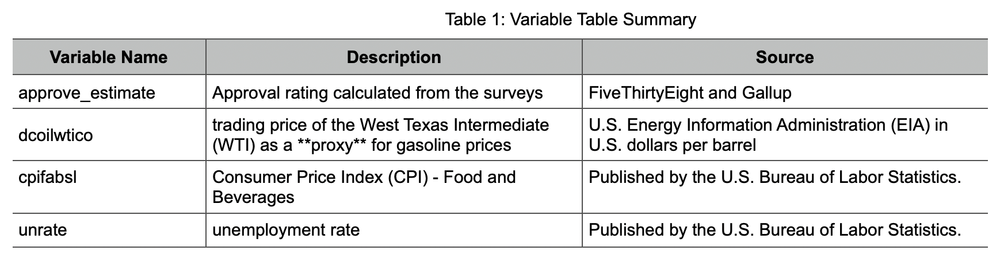
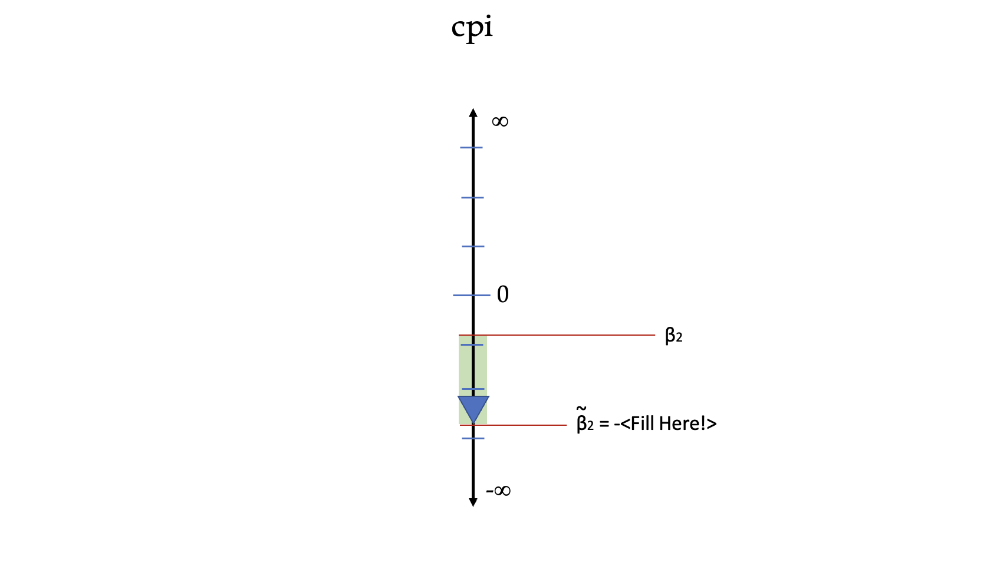

```{r, echo=FALSE, warning=FALSE}
# install.packages('formatR') # for some reason this is required for this to work so make sure it's installed
library(knitr)
opts_chunk$set(tidy.opts=list(width.cutoff=60),tidy=TRUE)
```

```{r Load libraries, include=FALSE}
library(dplyr)
library(ggplot2)
library(patchwork)
library(ggthemes)
library(stargazer)
dirname(rstudioapi::getActiveDocumentContext()$path)
setwd(dirname(rstudioapi::getActiveDocumentContext()$path))
```


```{r Load data, include=FALSE}
load('../data/interim/df_minus_events.RData') # TODO: change this to /processed
```

## Introduction

The United States is facing the most political polarization since the Civil War. According to the Pew Research Center, “Republicans and Democrats are more divided along ideological lines - and partisan antipathy is deeper and more extensive - than at any point in the last two decades”. In this context, presidential elections have largely turned into an exercise of animated bases within the two dominant parties, with emphasis veering away from actual policy work by politicians in charge.

If it’s possible to sum up a presidency in a single number, that number would be the president’s approval rating — or the share of Americans who approve of the job he or she is doing. Arguably, that simple percentage can determine the fate of an entire presidency. Administrations have also historically grown sensitive to this indicator to understand the citizen’s populous response towards the presidents and their agenda. In addition to this, historical data also strongly suggest that midterm elections are a referendum on the governing party. With midterm elections coming up next year in the U.S., and in the midst of this political climate, we want to examine the components of presidential approval rating, and in particular, the effects on gas prices on this variable.

On Nov. 23, 2021 the Biden administration announced that they were tapping into the U.S. strategic oil reserves to increase the supply of gasoline in light of the rapidly increasing gas prices that consumers and businesses across the country are facing. 

The rising gas and food prices have seen Biden’s approval ratings slump significantly, presumably because these are the ways in which the average consumer “experiences” the economy closest. Other economic indicators tend to trickle down to consumers in a much slower fashion, but consumers immediately feel the effect on their bottom line when they go to refuel their tank or at the supermarket.

In our study, we will analyze what effect gas prices have on the president's approval ratings. We will also analyze the effect of additional variables like food and beverage prices (CPI), and unemployment rate has on the president's approval rating. We also intend to analyze any key events as indicator variables in our research. We will expand our study to not only the currently sitting president, but also to the three presidents before him, in order to improve confidence in our model. 


## Research Design & Data

The main focus of this study is to answer following question:

**What is the effect of the gas price fluctuation on the current presidential approval rating?**

This study will focus solely on the United States. As such, any results are valid only in the specific context of American political life. The implications of these findings are of paramount importance to all levels of actors in the political sphere. From campaign managers to party leadership to political activists, the role economic factors play in presidential approval is an important, critical knob that all parties can intervene to further political agendas and projects.

We also intend to explore further into additional subquestions which we will study as covariates:

* How does unemployment numbers across the states affect the presidential approval rating?
* How does food and beverages CPI index affect the presidential approval rating?
* Does any significant event during a presidency influence the approval ratings?


### Data

In this section we describe the different datasets and variables of interest we consider for this study.

All economic data is sourced from the [St. Louis FRED](https://fred.stlouisfed.org/).


#### Crude oil prices (WTI)

Our main variable of interest is gasoline prices. Gasoline prices are probably the most immediate way that the average consumer experiences the economy in "real time". Given the sensitivity of gas prices to global economic shifts/policy, and the relative elasticity of the good, consumers' bottom lines are hit most immediately by the big red number they find at their nearest gas station. We therefore expect an increase in crude oil prices (as measured by WTI) to have a negative impact on presidential approval as well.

We have used the reported trading price of the West Texas Intermediate (WTI) as a **proxy** for gasoline prices in this study. This variable is highly correlated to the actual gas price that consumers pay, as most gasoline in the U.S. is refined from West Texas crude oil. Moreover, the WTI price is "the main oil benchmark for North America" (Investopedia, 2020) and is widely used in the financial industry as a price for the commodity.

This data is published daily by the U.S. Energy Information Administration (EIA) in U.S. dollars per barrel. Since the markets are closed on weekends these prices are actually published only during the weekdays. Given this limitation, we have decided to reuse the Friday value for Saturday and Sunday to maintain the daily resolution of our approval polls data.


```{r EDA for WTI, warning=FALSE, error=FALSE, echo=FALSE, message=FALSE, results='hide'}
summary(df$gas)
hist.wti <- ggplot(df, aes(gas)) +
	geom_histogram(bins=50) +
	scale_x_continuous(labels=scales::dollar) +
	theme_classic() +
	labs(title='Distribution of WTI prices', x='Closing price (USD p/barrel)', y='Frequency')
line.wti <- ggplot(df, aes(date, gas)) +
	geom_line() +
	theme_classic() +
	scale_y_continuous(labels=scales::dollar) +
	labs(title='Behaviour over time of WTI', x='Date', y='Closing price (USD p/barrel)')
hist.wti / line.wti
```

We note the dip under $0 USD in April 20, 2020 shown in the graph. This data point was in fact a time early during the COVID-19 pandemic where oversupply of oil resulted in a closing negative price for the WTI. While not an anomaly, we have decided to remove this data point from our analysis as an outlier which does not provide significant information on presidential approval.


```{r Approval rating vs gas, warning=FALSE, error=FALSE, echo=FALSE, message=FALSE}
## Approval rating vs gas
arg.coef <- mean(df$gas, na.rm = TRUE) / mean(df$approval, na.rm = TRUE)
ar.g <-  ggplot(df, aes(x = date)) +
  geom_line(aes(y = approval, color = 'approval')) +
  geom_line(aes(y = gas/arg.coef, color = 'gas')) +
  scale_y_continuous(
    name = "approval",
    sec.axis = sec_axis(~.*arg.coef, name="gas price")
  ) +
  scale_color_manual(name = "variables", values = c("approval" = "darkblue", "gas" = "darkred")) +
  labs(
    title = 'Approval rating vs gas price trend comparison'
  )
ar.g
```
Above is the comparison chart between presidential approval rating and WTI price. Even though it does not display an apparent inverse relationship between the two, from 2001 to 2009 and recent years show inverse relationships. We find this very interesting and would like to further investigate on how statistically meaningful is this relationship between approval rating and WTI price.

```{r, include=FALSE}
df <- filter(df, date != '2020-04-20')
```


#### Food and beverage prices (CPI)

Our other main variable representing the lived economy of consumers is the price of food and beverages. We contend that the other place where average consumers across all income levels most immediately feel the effects of the economy is at the supermarket. (TODO: maybe cite a study here). We have operationalized this concept using the Food & Beverage component of the Consumer Price Index (CPI), reported monthly by the U.S. Bureau of Labor Statistics in a seasonally adjusted fashion.

Similar to unemployment rate, since this value is published at a month-only resolution, we have decided to utilize the monthly value (published at the beginning of the following month) replicated across all days of that month to match the daily resolution of approval poll data.

We expect again a negative effect on presidential approval as food and beverage prices increase. This is because people are increasingly dissatisfied with federal administration when they cannot purchase the same goods or are having trouble feeding their families or themselves.


```{r Exploratory charts for CPI, warning=FALSE, error=FALSE, echo=FALSE, message=FALSE, results='hide'}
ggplot(df, aes(date, cpi)) +
	geom_line() +
	labs(title='Consumer Price Index for All Urban Consumers:\nFood and Beverages in U.S. City Average (2001-2021)', x='Date', y='CPI') +
	theme_classic()
```
We note that the CPI &mdash; specifically the Food and Beverage component &mdash; shows an increasing trend for the last 21 years (the notable exception is around the Great Recession of 2008/2009).


```{r Unemployment vs CPI, warning=FALSE, error=FALSE, echo=FALSE, message=FALSE, warning=FALSE}
## Unemployment + CPI
uc_coef <- mean(df$cpi, na.rm = TRUE) / mean(df$unrate, na.rm = TRUE)
unr.cpi <- ggplot(df, aes(date)) +
  geom_line(aes(y = unrate, color = 'unrate')) +
  geom_line(aes(y = cpi/uc_coef, color = 'cpi')) +
  scale_y_continuous(
    name = "Unemployment Rate",
    sec.axis = sec_axis(~.*uc_coef, name="CPI")
  ) +
  scale_color_manual(name = "variables", values = c("unrate" = "red", "cpi" = "darkorange")) +
  labs( title = 'Unemployment rate & CPI trends' )

## CPI + approval rating
ca_coef <- mean(df$approval, na.rm = TRUE) / mean(df$cpi, na.rm = TRUE)
cpi.ap <-  ggplot(df, aes(x = date)) +
  geom_line(aes(y = cpi, color = 'cpi')) +
  geom_line(aes(y = approval/ca_coef, color = 'approval')) +
  scale_y_continuous(
    name = "CPI",
    sec.axis = sec_axis(~.*ca_coef, name="approval")
  ) +
  scale_color_manual(name = "variables", values = c("cpi" = "darkorange", "approval" = "darkblue")) +
  labs( title = 'CPI & approval rating trends' )

unr.cpi / cpi.ap
```
We can immediately grasp that CPI is almost always increasing over time, which is understandable due to inflation. From the first graph, we can observe that CPI tends to dip a little whenever there is a spike in unemployment rate. This can be explained in a multiple different levels: 1. Government releasing funds to subsidize the public for better monetary circulation. 2. Slower economic growth due to high unemployment rate slows down the inflation, etc.

The chart for CPI vs approval rating shows interesting trends as well. It seems like for new presidencies (2009, 2017 & 2021), CPI slightly has its momentum in its increase. This may be due to expectations of a better economy from the newly launched administration. However, overall, CPI seems to show negative correlation with the approval rating.

#### Unemployment rate

The unemployment rate is published monthly by the U.S. Bureau of Labor Statistics, with adjustment for seasonality and is defined as

> ...the number of unemployed as a percentage of the labor force. Labor force data are restricted to people 16 years of age and older, who currently reside in 1 of the 50 states or the District of Columbia, who do not reside in institutions (e.g., penal and mental facilities, homes for the aged), and who are not on active duty in the Armed Forces.

Under the logic of the current study, unemployment rate is one of the measures we consider as "lived economy" for the average American citizen. As previously mentioned, economic indicators like the GDP and the trade deficit are hard to grasp concepts, but employment &mdash; or lack thereof &mdash; is an immediately perceivable and highly impacting variable in people's day to day lives. We would expect that increasing unemployment rates will have a negative effect on approval rates for the president in office.

We will note the low resolution of this data. Since this is only published monthly, we do not have the same level of resolution as the more frequently conducted approval polls data. Given the number of observations (240 months in the past 20 years), we do not think this will significantly impact results. (==TODO: CONFIRM==) Because of this, we have decided to replicate the monthly figure for all days in the month to correlate with the daily value of approval.

The U.S. BLS has data going back to 1948, and we have restricted ourselves to the monthly percentage reported for the period of interest.


```{r Exploring unemployment rate data, warning=FALSE, error=FALSE, echo=FALSE, message=FALSE, results='hide', warning=F}
ggplot(df, aes(date, unrate)) +
	geom_line() +
	scale_y_continuous(labels = function(x) paste0(x, '%')) +
	theme_classic() + 
	labs(title='Unemployment rate 2001-2021', x='Date', y='Unemployment rate (%)')
```

```{r warning=FALSE, error=FALSE, echo=FALSE, message=FALSE, results='hide'}
summary(df$unrate)
```

In general, the unemployment rate has been decreasing in the past decade. Over the past twenty years it mostly stayed under 11%. We note the significant peak (rising to almost 15% of the working class population) during the beginning of the COVID-19 pandemic in March and April 2020.


```{r Unemployment vs approval rating, warning=FALSE, error=FALSE, echo=FALSE, message=FALSE, warning=F}
## Unemployment + approval rating
uc_coef <- mean(df$approval, na.rm = TRUE) / mean(df$unrate, na.rm = TRUE)
unr.ap <- ggplot(df, aes(date)) +
  geom_line(aes(y = unrate, color = 'unrate')) +
  geom_line(aes(y = approval/uc_coef, color = 'approval')) +
  scale_y_continuous(
    name = "Unemployment Rate",
    sec.axis = sec_axis(~.*uc_coef, name="approval")
  ) +
  scale_color_manual(name = "variables", values = c("unrate" = "red", "approval" = "darkblue")) +
  labs( title = 'Unemployment rate & approval rating trends' )

unr.ap
```
Unemployment rate vs approval rating graph actually surprised us. It seems from the graph that delta and direction of unemployment rate did not seem to have a negative relationship with the approval rating. This may be due to the public's unawareness of the specifics of the policies that the government provides to mitigate the unemployment during uneventful times. However, as we can observe from the graph, when unemployment rate is decreasing from a peak, approval rating seems to climb as well. We suspect that this may be because the public is aware of the bad economic climate and recognize the government's effort to mitigate the high unemployment rate.

The variables of interest from the different datasets are summarized below:



#### Event data
```{r, include=F}
# ## COVID graph
# cov_coef <- 325
# cov.g <- df %>%
#   ggplot() +
#   aes(x = date) +
#   geom_line(aes(y = new_covid_cases, color = 'new_covid_cases')) +
#   geom_line(aes(y = total_covid_cases/cov_coef, color = 'total_covid_cases')) +
#   scale_y_continuous(
# 
#     # Features of the first axis
#     name = "new_covid_cases",
# 
#     # Add a second axis and specify its features
#     sec.axis = sec_axis(~.*cov_coef, name="total_covid_cases")
#   ) +
#   scale_color_manual(name = "variables", values = c("total_covid_cases" = "darkgray", "new_covid_cases" = "darkgreen")) +
#   labs(
#     title = 'COVID cases trend (total + new)'
#   )
# ## total vs approval
# ta_coef <- 0.00000125
# cov_t.ap <- df %>%
#   ggplot() +
#   aes(x = date) +
#   geom_line(aes(y = total_covid_cases, color = 'total_covid_cases')) +
#   geom_line(aes(y = approval_rating/ta_coef, color = 'approval_rating')) +
#   scale_y_continuous(
# 
#     # Features of the first axis
#     name = "total_covid_cases",
# 
#     # Add a second axis and specify its features
#     sec.axis = sec_axis(~.*ta_coef, name="approval_rating")
#   ) +
#   scale_color_manual(name = "variables", values = c("total_covid_cases" = "darkgray", "approval_rating" = "darkblue")) +
#   labs(
#     title = 'total COVID cases & approval rating trends'
#   )
# 
# ## new vs approval
# na_coef <- 0.000325
# cov_n.ap <- df %>%
#   ggplot() +
#   aes(x = date) +
#   geom_line(aes(y = new_covid_cases, color = 'new_covid_cases')) +
#   geom_line(aes(y = approval_rating/na_coef, color = 'approval_rating')) +
#   scale_y_continuous(
# 
#     # Features of the first axis
#     name = "new_covid_cases",
# 
#     # Add a second axis and specify its features
#     sec.axis = sec_axis(~.*na_coef, name="approval_rating")
#   ) +
#   scale_color_manual(name = "variables", values = c("new_covid_cases" = "darkgreen", "approval_rating" = "darkblue")) +
#   labs(
#     title = 'new COVID cases & approval rating trends'
#   )
# 
# cov.g
# cov_t.ap
# cov_n.ap
```


## Statistical model


To estimate the effect of gas prices &mdash; and related economic variables &mdash; on presidential approval numbers, we model this last indicator as a linear function of the WTI closing prices, which also accounts for the individual presidencies.

We esimtate and compare this to a model that includes the relevant economic data and finally one that includes pivotal events in the each president's tenure as described by previously.

### Model 1

Model 1 is our base model that includes only the gas prices as a predictor variable and has the approval as the outcome variable. This model &mdash; as well as all subsequent ones &mdash; account for the president in turn through indicator variables with one for Joe Biden ($\beta_2$), Donald Trump ($\beta_3$), George W. Bush ($\beta_4$), and Barack Obama being the omitted category.

$$
\text{approval} = \beta_0 + \beta_1 \text{gas price } + \beta_2\text{Joe Biden } + \beta_3\text{Donald Trump } + \beta_4\text{George W. Bush } 
$$

```{r Model 1, include=F}
m1 <- lm(approval ~ gas + president, data = df)
```


### Model 2

A second specification adds the additional relevant economic indicators identified in our theoretical model and research.

$$
\begin{aligned}
\text{approval} &= \beta_0 + \beta_1 \text{gas price } + \beta_2\text{Joe Biden } + \beta_3\text{Donald Trump } + \beta_4\text{George W. Bush } \\
&+ \beta_5 \text{CPI} + \beta_6 \text{unemployment rate }
\end{aligned}
$$
```{r Model 2, include=F}
m2 <- lm(approval ~ gas + cpi + unrate + president,  data = df)
```

### Model 3

Our third specification adds the relevant event data to account for major events within the corresponding presidential term, as we established in our theoretical model that how presidents respond to these events and their handling are major sources of variance in presidential approval.

$$
\begin{aligned}
\text{approval} &= \beta_0 + \beta_1 \text{gas price } + \beta_2\text{Joe Biden } + \beta_3\text{Donald Trump } + \beta_4\text{George W. Bush } \\
&+ \beta_5 \text{CPI} + \beta_6 \text{unemployment rate } + \ldots + \beta_i event_i
\end{aligned}
$$

```{r Model 3, include=F}
# m2 <- lm(approval ~ gas + cpi + unrate + president,  data = df)
```

where $event_i$ is an indicator variable for the $i^{th}$ event with an associated regression coefficient $\beta_i$ for all events described previously.

## Results

```{r Model results, results='asis', warning=FALSE, error=FALSE, echo=FALSE, message=FALSE}
stargazer(m1, m2, header=F, title="Results", align=TRUE)
```


## Discussion

### Generalizability

### Significance

### LSM assumptions

We have fairly large sample size (> 100 rows) of data in our collected sample, hence we evaluated the Large Sample Model assumptions:

#### IID

We have taken the data from FiveThirtyEight who moderates and collects data from various pollsters who inherently run these surveys with American to record their responses for presidential approval ratings. Additionally, FiveThirtyEight ensures to negate any `house` effect to eliminate biases. The randomness of the survey participant selection indicates that the collected data would meet IID requirements.

#### Unique BLP exists

The sample size is significantly higher than 30 and Central Limit Theorem (CLT) would apply. Also, there seems to be no multi-collinearity among the variables which was also evident during modeling. Hence, we can say that we would meet the sufficient conditions for meeting existence of unique BLP.

### Omitted Variable Bias

The causal relationship that we have attempted to establish in our model was the effect of gas price fluctuations on current president’s approval ratings. We also identified additional co-variates and modeled their impact on the outcome variable. Now, let's look at some of the variables that we may have omitted but could introduce bias in terms of effects on the coefficients for the variables we have considered.

#### Immigration

We can reason that `immigration` could be an omitted variable in this causal analysis which could introduce severe bias if included in the regression model. `Immigration` can be measured in-terms of net immigration into the United States which is also dependent on the ongoing Covid-19 restrictions on entry from various countries and also constrained operation of the consulates in host countries. There also exists illegal immigration through boarders for which official accounts do not exists.

**True Model       :** $$\text{approval\_rating} = \beta_0 + \beta_1 \text{gas\_price} + \beta_2 \text{cpi} + \beta_3 \text{unemployment\_rate} + \beta_4 \text{immigration}$$

**Approximate Model    :** $$\text{approval\_rating} = \tilde{\beta}_0 + \tilde{\beta}_1 \text{gas\_price} + \tilde{\beta}_2 \text{cpi} + \tilde{\beta}_3 \text{unemployment\_rate}$$

We won't be able to accurately calculate the effect because of unavailability of accurate and accountable data on `immigration`, however we will try to speculate the effect of `immigration` coefficient and direction of bias with the other co-variates based on our domain knowledge.

First, let's see how `immigration` directly affect our outcome variable `approval_rating`. Immigration is a sensitive topic in the country today and with Covid-19 affecting the GDP and people's earning power across the spectrum, there is undoubtedly a sentimental vibe against immigration across a segment of population. As the government sways towards a liberal immigration policy, it may have a negative impact on the `approval rating`. Hence, we can speculate that the coefficient of immigration as a co-variate ($\beta_4$) in regression equation will have `negative` effect on outcome variable. Immigrants, at least the undocumented ones, are not tracked by government agencies for their (un)employment rate hence may not have effect on the co-variate `unemployment_rate`. Also, there is no clear evidence that immigration may be affecting the `gas_price` which is mostly influenced by government policies and supply~demand ratio. However, immigration may have statistically significant impact on farming and food prices. It is a known fact that undocumented immigrants constitute a considerable workforce as seasonal farm workers and other low paying jobs in food economy. Unavailability of these low cost seasonal labor often result in increased produce cost for citizen, and that drives the `cpi` higher, so the coefficient ($\delta_1$) will most likely be `negative`. The Omitted Variable Bias (OVB) for `cpi` ($\tilde{\beta}_2 - {\beta}_2$) will be `positive` in this case and the direction of omitted variable biases here would be **away from zero**.



#### Natural Disasters

We can reason that `Natural Disasters` could be an omitted variable in this causal analysis which could introduce severe bias if included in the regression model. `Natural Disasters` could create an indirect effect on approval rating as it tends to frustrate people on the situation they are put in, and often best effort by government fall short of making up for the loss people incur. Also, natural disasters like forest fires creates direct impact on local farming industry and that temporarily drives the food prices up.

**True Model       :** $$\text{approval\_rating} = \beta_0 + \beta_1 \text{gas\_price} + \beta_2 \text{cpi} + \beta_3 \text{unemployment\_rate} + \beta_4 \text{natural\_disaster}$$

**Approximate Model    :** $$\text{approval\_rating} = \tilde{\beta}_0 + \tilde{\beta}_1 \text{gas\_price} + \tilde{\beta}_2 \text{ cpi } + \tilde{\beta}_3 \text{unemployment\_rate}$$

We won't be able to accurately calculate the effect because of unavailability of accurate and measurable data on `natural_disaster`, however we will try to speculate the effect of coefficient and direction of bias with the other co-variates based on our best judgement.

Natural disasters creates imbalances in people's life and people often blame the government in failing to take care of them which in short term may drag the approval ratings down. If it could be quantified by data then it would possibly be a `negative` coefficient ($\beta_4$) when regressed with our outcome variable `approval_rating`. Also, it would have omitted variable bias with `cpi`. Natural disasters often temporarily stalls the local economy and supply chain which drives the food prices high, so the coefficient ($\delta_1$) will most likely be `positive`. The Omitted Variable Bias (OVB) for `cpi` ($\tilde{\beta}_2 - {\beta}_2$) will be `negative` and the direction of omitted variable biases here could be **away from zero**.


## Limitations of the Research

In the previous discussions we have stated certain assumptions that were made and accordingly prepared our data for modeling. Each of the data-sets is a very much relevant for our study, however, there are certain limitations that we do acknowledge:
* Weight adjusted approval rating: Even though we are basing our response variable `Y` from the adjusted approval ratings by different weights, we are not perfectly aware of how the weights are calculated. Since we are unaware of the exact mechanisms behind the weight calculation, we are not 100% confident that the approval rating is genuinely the representation of how the public feels about its contemporary presidents. This issue leads to another potential limitations to our research.
* Bipartisan nature of the USA: Connecting from the previous potential limitation, since the USA is a mostly bipartisan country, we cannot ignore the effect of one party in power affecting the other partisans. Since we are unaware of the exact mechanisms behind the weight calculation to measure the true feeling of the public, it is difficult to accurately capture the approval of presidents from the public.

### Impact of temporary events

Temporary events and thereby the coverage in new media sometimes create transient effects on these surveys where the approval or disapproval shoot up or down for the duration. As the new cycles settle or move over, the data becomes more reliable. We will consider these as outliers and focus on normal results.

### Candidate's Popularity

Some of the presidents have had a popular personality even before they took the office. This may influence the overall surveys and hence this study.

### Missing WTI Crude price for holidays

We observed that the WTI index is not updated for weekends and holidays. This was handled by rolling over the prior day's data, but it does come forward as a data limitation in the study.

### Unemployment & CPI Monthly Index

The unemployment rate and CPI are monthly measurements where as approval and oil prices are daily measurements. For this study we definitely did not want to capture key economic indicators like food prices and unemployment rate. Lack of any high precision data we decided to take the month data and explode it to daily index and progressed with the study. 


## Conclusion

Based on our research, we have found that the increase in oil prices, unemployment rate, and food & beverage prices (signified by CPI) - all have a statistically (highly) significant impact over the presidential approval rating. As the corresponding measurements trend upward, the less popular presidents appeared in the surveys. Interestingly, the overal effect is larger in the case of republican presidency. The slopes for all predictor variables are negative in our model which signifies that the relationship is clearly inverse.

We also observed that unemployment rate has the largest impact on the presidential approval rating. This is a new finding for us as our original hypothesis was that oil prices has largest impact on the ratings. Our recommendation is to track the unemployment rates more closely, preferably more frequently, and do further study in this specific domain to understand the fluctuations and factors affecting the increase in unemployment rate. It is of paramount important for country to maintain a healthy economy, all it's residents are able to find a job and take care of their families. The study also clearly notes what is important for citizens in United States, and what priorities should drive the Presidents agenda in his or her tennure in the office.


## References


- U.S. Energy Information Administration, Crude Oil Prices: West Texas Intermediate (WTI) - Cushing, Oklahoma [DCOILWTICO], retrieved from FRED, Federal Reserve Bank of St. Louis; https://fred.stlouisfed.org/series/dcoilwtico, December 1, 2021.
- U.S. Bureau of Labor Statistics, Unemployment Rate [UNRATE], retrieved from FRED, Federal Reserve Bank of St. Louis; https://fred.stlouisfed.org/series/UNRATE, December 4, 2021.
- U.S. Bureau of Labor Statistics, Consumer Price Index for All Urban Consumers: Food and Beverages in U.S. City Average [CPIFABSL], retrieved from FRED, Federal Reserve Bank of St. Louis; https://fred.stlouisfed.org/series/cpifabsl, December 5, 2021.
- Hlavac, Marek (2018). stargazer: Well-Formatted Regression and Summary Statistics Tables. R package version 5.2.2. https://CRAN.R-project.org/package=stargazer
